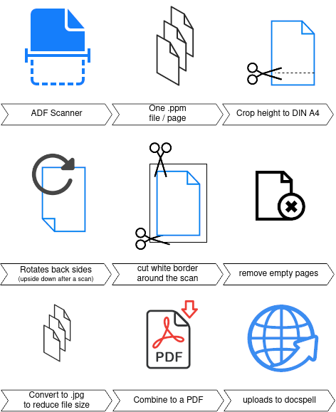

# scanadf2docspell

This script scans from the ADF (Automatic Document Feeder), preprocesses it and uploads it to Docspell.



## Prerequisites

* A running [Docspell](https://github.com/eikek/docspell) instance.
* Any Linux distro (tested on Ubuntu 20.04)
* Install system requirements (apt command on Ubuntu:)
  ```bash
  sudo apt install sane python3 python3-pip libmagickwand-dev img2pdf sane-utils
  ```
* Setup sane to have [scanadf](https://linux.die.net/man/1/scanadf) avalaible.
* See if scanadf is able to find your scanner
  ```
  scanadf -L
  ```
    * if scanner is not found -> check `sane-find-scanner`
        * Maybe also as sudo to see if it's an privileges problem
        * If yes try `sudo adduser <username> lp` and logout/login and restart scanner

## Install

* Clone the repository
  ```bash
  git clone https://github.com/eresturo/scanadf2docspell
  ```
* Install requirements
  ```bash
  cd scanadf2docpsell
  pip3 install -r requirements.txt
  ```
* Generate a API-Key, as described [here](https://docspell.org/docs/webapp/uploading/#anonymous-upload)
* create a config file `custom.conf`
    ```yaml
    api_key = YOUR_API_KEY
    docspell_url = http://YOUR_DOCSPELL_URL
    ```

## Scan

* insert a document in your scanner and run
    ```bash
    ./scan.py -c custom.conf
    ```
* See help for further configuration options.
  ```bash
  ./scan.py --help
  ```
  ```
  usage: scan.py [-h] --api_key API_KEY --docspell_url DOCSPELL_URL [-n NAME] [-d] [-o] [--keep_scans] [--keep_pdf] [--empty_threshold EMPTY_THRESHOLD] [--device DEVICE] [--resolution RESOLUTION] [--source SOURCE]
               [--source_duplex SOURCE_DUPLEX] [--preview PREVIEW] [--skip_backside_rotation] [--skip_trim_pages] [--skip_empty_page_removal] [--skip_length_trimming]

  Scan from ADF, preprocess and upload do Docspell. Args that start with '--' (eg. --api_key) can also be set in a config
  file (defaults.conf or custom.conf). Config file syntax allows: key=value, flag=true, stuff=[a,b,c] (for details, see
  syntax at https://goo.gl/R74nmi). If an arg is specified in more than one place, then commandline values override config
  file values which override defaults.

  optional arguments:
  -h, --help show this help message and exit 
  --api_key API_KEY Docspell's API KEY 
  --docspell_url DOCSPELL_URL Url to docspell, e.g. http://<docpsell_host>:7880/ 
  -n NAME, --name NAME Name of the scan. Default is a random String 
  -d, --duplex Scan front and back pages 
  -c, --color Do a colored scan 
  --keep_scans Do not delete raw scans 
  --keep_pdf Do not delete combined pdf 
  --empty_threshold EMPTY_THRESHOLD Threshold to determine if a page is empty. The emptier a document is, the smaller it' value becomes. 
  --device DEVICE Device name (e.g. SCANNER_ABC). Default: None (use systems default scanner)
  --resolution RESOLUTION Scan resolution in dpi 
  --source SOURCE Scanners source 
  --source_duplex SOURCE_DUPLEX Scanners source in duplex mode 
  --preview PREVIEW Show a preview before uploading to docspell
  --skip_backside_rotation In duplex mode backsides are rotated, so the scripts rotates them back. Enable this to skip rotation.
  --skip_trim_pages By default the white border around pages will be removed. Enable this to skip trimming pages.
  --skip_empty_page_removal By default empty pages are deleted. Enable this to skip empty page deletion.
  --skip_length_trimming By default length of the scans is trimmed to DIN A4 ratio. Enable this to skip trimming page lengths.
  --start_count START_COUNT Overwrite the first page number. Useful if the scan was canceled and you want to resume a scan.
  ```

## Contribution

Suggestions, feature requests, ideas to improve the script? Feel free to open an issue or send a pull request :)  